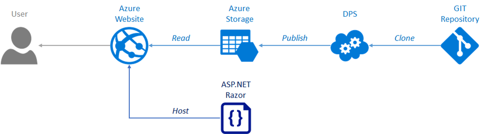
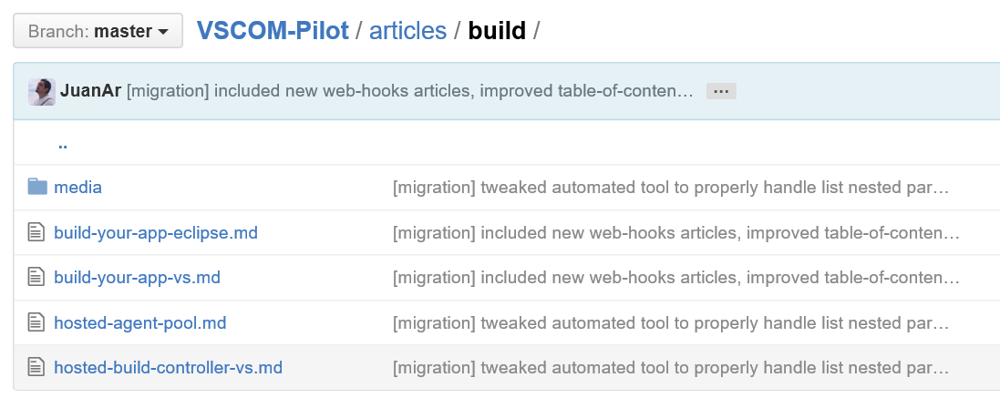
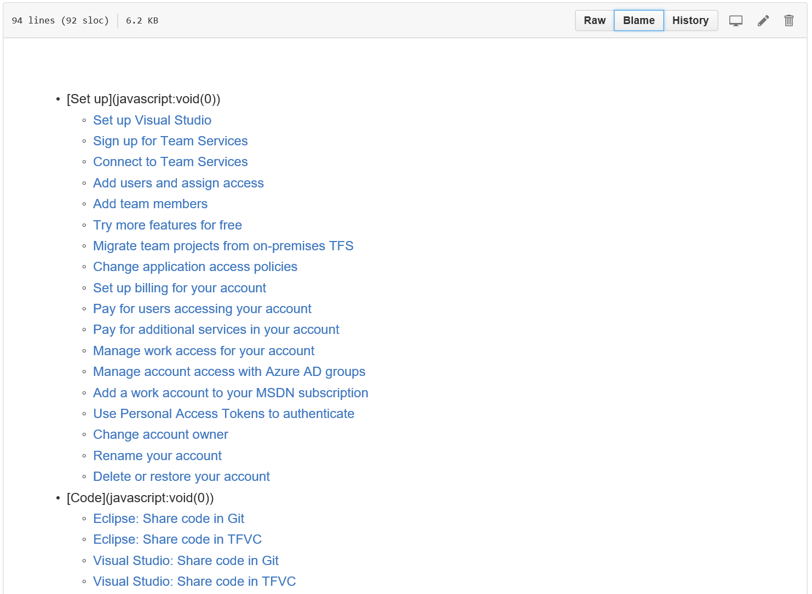
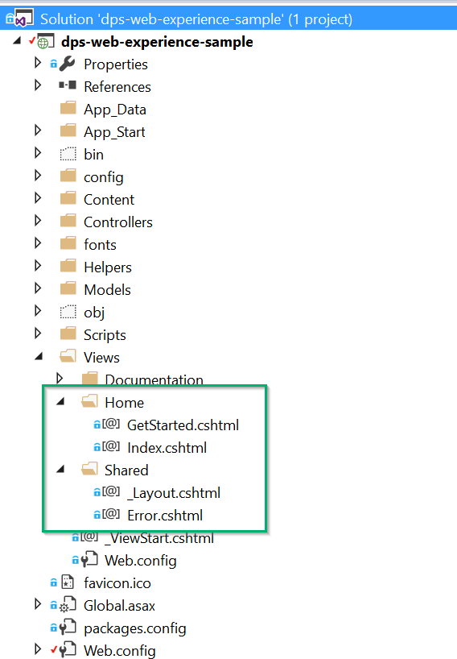
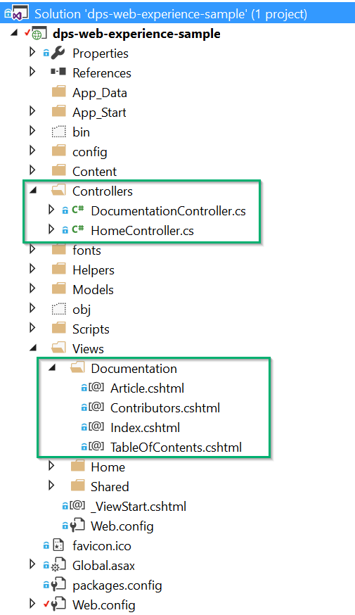
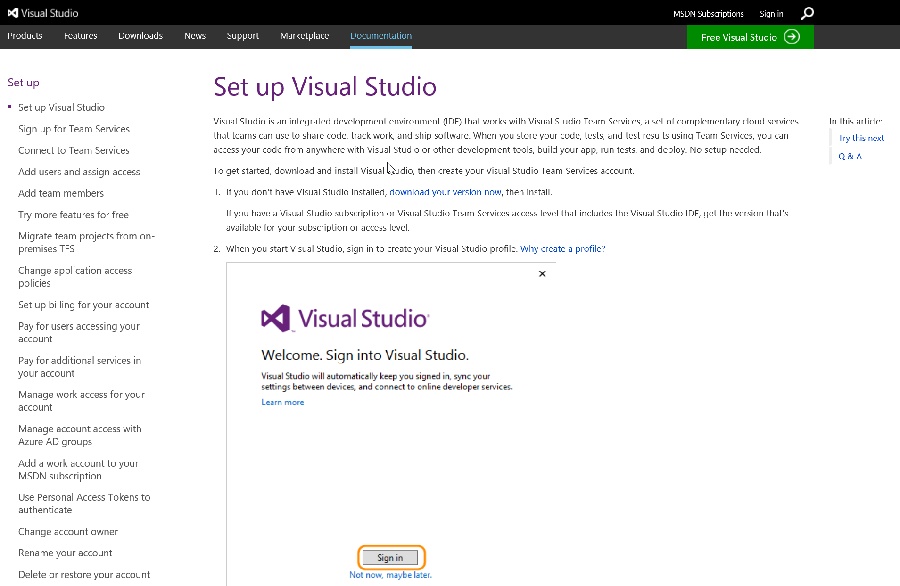
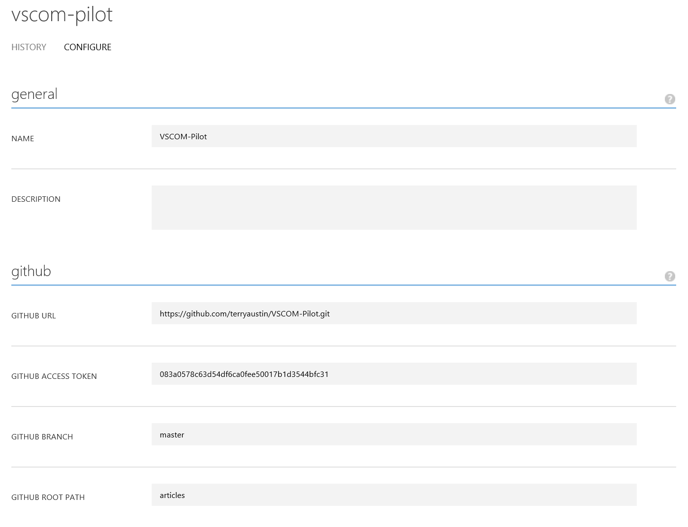
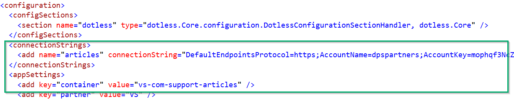
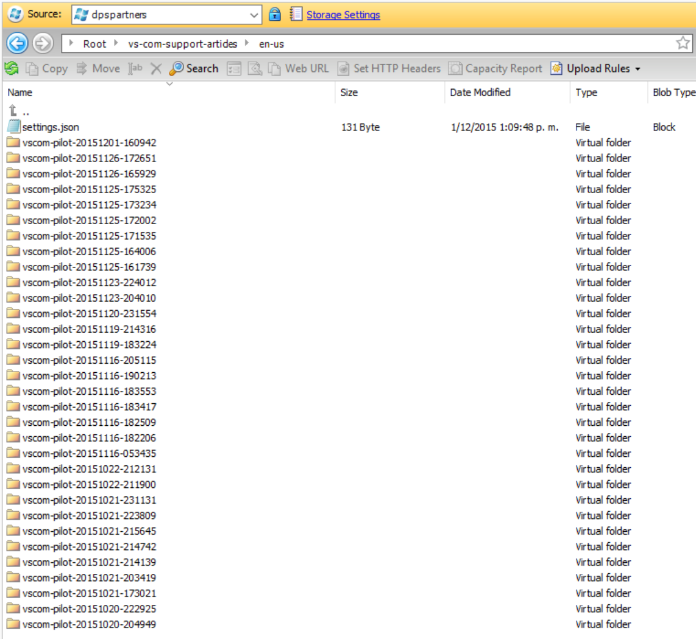

# DPS Documentation MVC Website

The DPS Documentation MVC sample website is a C# MVC 4 solution including route definition, controllers and views configured to render DPS converted HTML content from an Azure Storage account. These content is converted from Markdown documents stored within a GIT repository which was migrated using ReverseMarkdown from the visualtudio.com website.

## Content repository

[https://github.com/terryaustin/VSCOM-Pilot](https://github.com/terryaustin/VSCOM-Pilot)

* The content repository contains all Markdown documentation files migrated from the visualstudio.com website.
* A custom folder structure is allowed for organization purposes; this do not impact the publishing process. However, structure is flatten by DPS so filenames should be unique.
* Article images are also uploaded to the repository and each article includes its accompanying media file within its own subfolder.
* Additional metadata is included as part of the documents, this is used and validated by DPS and stored as Blob properties.
* A special table-of-contents.md document was created to render the left nav TOC on each article. It currently contains some placeholder metadata that will be removed in the future.
* Changing or adding article content is made by editing or adding new Markdown files to the repository.

|Articles|Table of Contents|
|--------|-----------------|
|||

## VSCOM-Pilot Website

[http://vs-com-support-docs.azurewebsites.net](http://vs-com-support-docs.azurewebsites.net) ([source code](https://github.com/southworkscom/visualstudio-web))

* Heavy design pages, layout and style assets (CSS + images) are part of the C# MVC solution. This solution can be simply published to any Azure Website using the Visual Studio tooling or Azure Websites Source Control Integration feature.
* The Documentation controller and its views contains logic to render DPS converted articles.
* The web.config contains the Azure Storage account connection string and the container where the converted articles are stored. A DPS specific versioning schema is used to maintain a publishing history.
* Changing or adding design pages to the website is made by editing or adding new cshtml Razor views to the MVC  solution.

|Design Views|Documentation|
|--------|-----------------|
|||

#### Website Article

## DPS Configuration

[https://acomportal.azure.net/#Workspaces/DocumentationPublishing/PublishConfigurations/48ac2ee3-54eb-4a2f-9994-126f8bed6c14](https://acomportal.azure.net/#Workspaces/DocumentationPublishing/PublishConfigurations/48ac2ee3-54eb-4a2f-9994-126f8bed6c14)

* DPS Configurations consist of settings used to retrieve content from a GIT repository, convert and process Markdown documents into HTML content and upload the result to Azure Blob Storage.
* Some additional features are available: Validations, Repository tagging, Notifications, Continuous Publishing, CDN media.

## Azure Storage Account

* Markdown articles are processed by DPS and uploaded to Azure Blob Storage. This is configured in DPS Job Configuration tab.
* The MVC Website and the Azure Storage account are connected together using the Articles' connection string and container settings in the web.config file.

---
